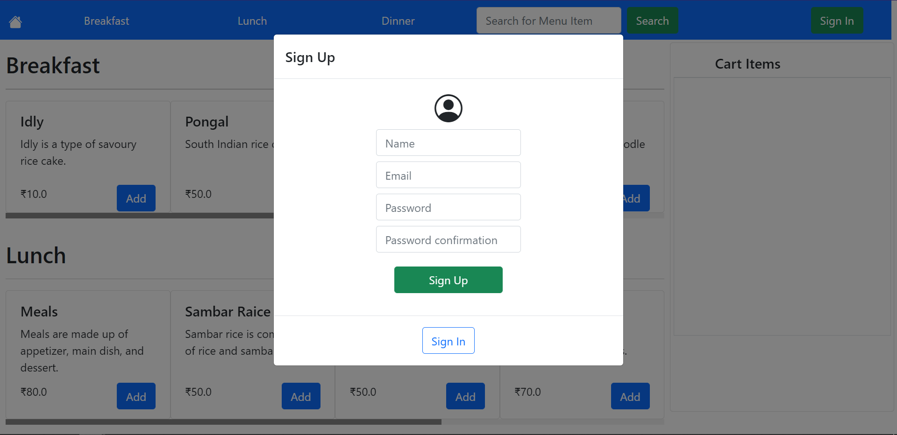
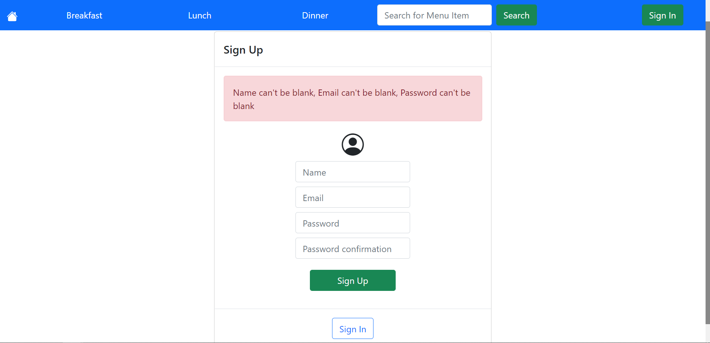
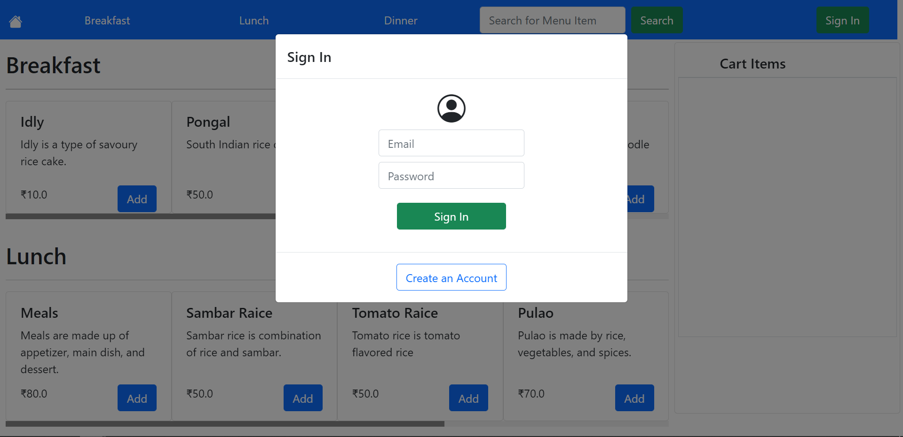
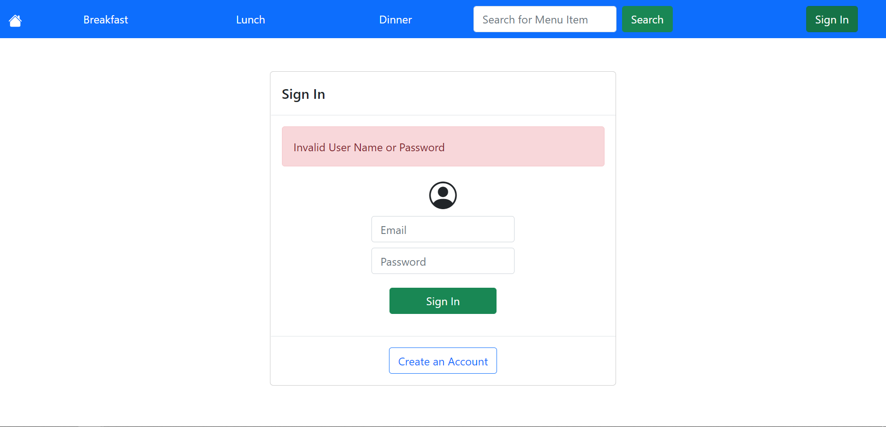

# [Cafeteria Management App](https://madhan-cafeteria-management.herokuapp.com)

This app is built to manage a restarunt. This app has Three personas admin, clerk, customer. Only a customer can signup, other others cannot. An admin can create, update, delete other admins and clerks. Admin can create, update, delete Menu category and Menu Item. Admin and clerk can view all orders and mark as cancel or delever. Customers and clerk can view all menu category, menu item, and can cart menu Items any menu item that is available and place order. Customers can view, cancel only their orders.

## Sample Users

|Email               | Password|
| ----               | ----    |
|owner@email.com     | owner   |
|clerk@email.com     | clerk   |
|customer@email.com  | customer|

## [Home page](https://madhan-cafeteria-management.herokuapp.com)

## Sign-up page

## Sign-in page

## Home page for Admin

## Home page for Clerk and Customer

## User Profile

## Orders Page for Admin and Clerk

## Orders Page for Customer

## Cart Items Page

